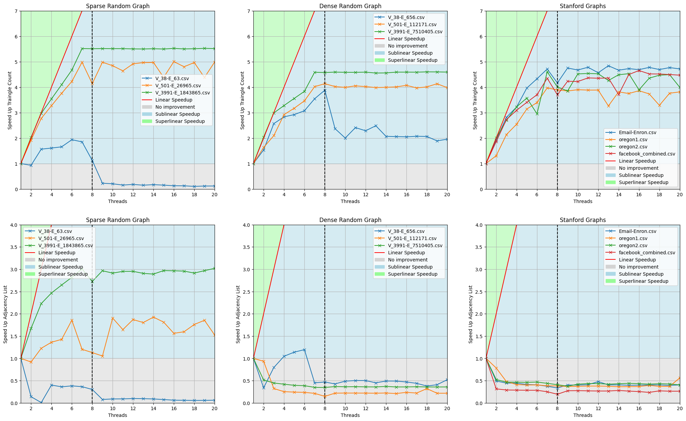

# Benchmark on Sequential and Parallel Graph Triangle Counter Problem
Comparison between Sequential and Parallel version of the Graph Triangle Counter problem.

## Startup
In order to run the benchmark you have to run these command in your console:
```
sudo apt update
sudo apt install build-essential
sudo apt-get install libboost-all-dev
```

After that, to compile the project, you have to jump into the */app/src* folder and type the following line in your console:

```
g++ -std=c++2a -fopenmp -o ../bin/app Main.cpp
```

For compier optimization instead type:
```
g++ -std=c++2a -fopenmp -O3 -o ../bin/app Main.cpp
```

The *.exe* file will be inserted into the */app/bin* directory.

## Usage
Start the application by typing ```./app```. Next you have only to specify:
* If you want to override the existing random generated graph and creatig other one:  _0_ or _1_

During the execution of the benchmark the application will go through these steps for both the Stanford graphs and the radom generated graphs:
1. Read the .csv file and create the respecitve edegs list
2. Create the adjacency list from the edge list 
3. Compute the number of triangle given the edge ad adjacency lists

The step **2** and **3** are repeated starting from 1 thread up to 20 threads. Moreover at the end of each run of step 2 and 3 the application will print out usefull statistics, like the number of detected trangle, the elapsed time taken for the triangle count and adjacency list creation procedure and tus also both speedups.

## Results
These result was achived running the application on a HP ElideDesk G1 TW with 8 cores CPU:

